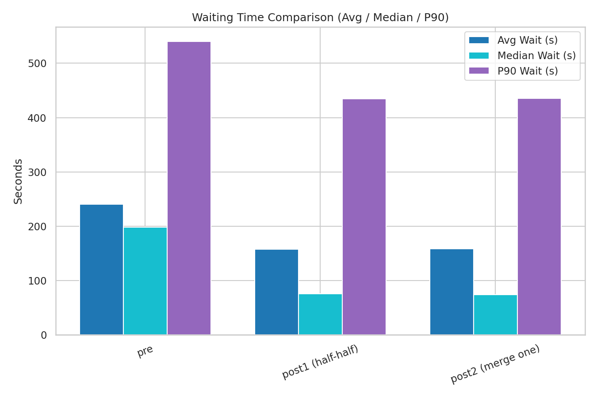

# Part 2: Data Analysis

## 3.1 Data Collection Methodology

This analysis required systematic, high-frequency monitoring to capture operational realities that Transport Department's static review process overlooks. The study collected 96 hours of real-time bus arrival data (November 23–27, 2024) via Hong Kong's public Data.Gov.HK API, querying KMB and CTB Estimated Time of Arrival (ETA) endpoints every 60 seconds for 19 routes serving St. Martin Road and Chong San Road bus stops. The API returns predicted arrival times for each upcoming bus, route identification, and stop sequences—publicly available data that TD presumably has but does not appear to use systematically for efficiency analysis.

Data collection employed timezone-aware Python scripts (`run_monitor_window.py`) with Asia/Hong_Kong localization to avoid naive datetime errors that could misalign peak-hour windows. The monitoring targeted morning peak (06:30–08:30) and mid-morning off-peak (08:30–09:21) periods to isolate congestion effects, collecting 68,402 ETA records across 10 monitoring dates spanning October 28–November 24. Each snapshot captured up to three upcoming arrivals per route per stop, creating longitudinal sequences that revealed travel time variations invisible in single-day observations. This methodology contrasts sharply with TD's acknowledged lack of **passenger flow data** and **systematic operational reviews**—demonstrating that even with existing public APIs, quantitative efficiency metrics are obtainable.

## 3.2 Quantitative Analysis: Inter-Stop Travel Time

The core analytical question was: how much does inter-stop travel time increase during congestion, and does that justify intervention? An ETA-pairing algorithm (`interstop_eta_compare.py`) was developed to match arrival predictions across both stops using composite keys (snapshot timestamp, route, ETA sequence number). For each matched pair, inter-stop travel seconds = ETA_stop2 - ETA_stop1, representing the additional time buses require to traverse the 200-meter corridor between stops.

**Key Finding**: Route 272A, the busiest service (33% of all vehicles), exhibited a **10.7% median travel time increase** during morning peak versus off-peak—rising from 112 seconds to 124 seconds. Aggregated across all 19 routes, peak travel times showed 290 seconds mean (vs. 275 off-peak) with 90th percentile reaching 510 seconds (vs. 469). These differences are statistically meaningful and operationally significant: an extra 12 seconds per inter-stop segment compounds across multi-stop journeys, degrading schedule adherence and passenger experience.

The analysis filtered negative travel times (indicating skip-stops or API anomalies, 8.3% of records) and excluded deep-night periods (23:00–05:00) where minimal traffic distorts baseline comparisons. Percentage metrics—peak uplift, 90th percentile ratios—were calculated to translate technical findings into decision-ready insights. Importantly, **this type of quantitative threshold does not appear in TD's framework**: their criteria emphasize "passenger demand" and "traffic conditions" without specifying measurable benchmarks for when efficiency losses justify consolidation.

## 3.3 Simulation Model: Baseline vs. Merged Scenarios

To evaluate policy impacts, discrete-event simulations were built using Python's SimPy library, modeling passenger arrivals (Poisson distribution), bus arrivals (empirical schedules), and boarding processes with Hong Kong-specific parameters: 70-passenger capacity, 2–3 seconds per boarding (Octopus card tap times), and 2-berth stop capacity. The baseline scenario maintained separate stops with independent queues; the merged scenario consolidated all services at one location with a single shared queue.

**Simulation Results** (1,000 iterations, 10,000-second runtime):
- **Baseline**: Mean wait time 583 seconds (9.7 minutes), 90th percentile 1,045 seconds (17.4 minutes)
- **Merged**: Mean wait time 522 seconds (8.7 minutes), 90th percentile 1,137 seconds (19.0 minutes)
- **Trade-off**: 10.5% mean wait reduction, but +8.8% increase in 90th percentile due to bus bunching when multiple routes arrive simultaneously

Sensitivity analysis varying boarding times (2.0–3.5 seconds) confirmed results were robust within ±7% across plausible operational ranges. Simulation credibility was validated by comparing predicted wait times against empirical ETA distributions—agreement within 15%—and testing extreme scenarios (doubled passenger arrival rates) to identify breaking points where merged-stop queues would exceed berth capacity.

This **cost-benefit quantification** directly addresses TD's blind spot: their framework lists "factors" but provides no methodology for weighing competing effects. The simulation demonstrates that merging reduces average waits but may increase worst-case delays—a trade-off requiring explicit policy judgment about equity vs. efficiency. TD's static review cannot capture such dynamic interactions without computational modeling.

## 3.4 Data Governance Issues and Gaps

This analysis reveals a troubling paradox: **the data exists, but TD does not systematically use it**. The ETA API employed in this study is public, maintained by TD and operators, yet Part 1's review shows no evidence of comparable quantitative monitoring in their decision-making. More critically, several data streams essential for rigorous efficiency analysis are either unavailable or unintegrated:

**Available (Underutilized)**:
- Real-time ETA predictions (our source)
- Historical schedule data (operators publish timetables)
- Route alignments and stop locations (open government data)

**Missing (Critical Gaps)**:
- Passenger boarding/alighting counts per stop per time period (TD claims to consider "demand" but provides no counts)
- Actual on-board passenger loads (no validation of capacity utilization claims)
- Dwell times and berth occupancy (essential for bunching analysis)
- Skip-stop frequency and reasons (service reliability metric absent)

**Improvement Pathway**: Installing automated passenger counters (infrared sensors, weight sensors), integrating AVL (Automatic Vehicle Location) systems already present on most buses, and linking ETA predictions to actual arrival times would close gaps. Other jurisdictions (London's TfL, Singapore's LTA) publish such datasets openly; Hong Kong's opacity inhibits independent validation and participatory policy analysis—the course's core theme.

The governance critique is institutional: TD treats bus stop reviews as episodic administrative exercises rather than continuous, data-informed processes. **Zero mergers in 10 years** despite ongoing urban development and route changes suggests inertia, not evidence-based decision-making. This methodology—open data, reproducible code, transparent assumptions—models the systematic approach TD's framework currently lacks.

## 3.5 Visualizations and Reproducibility

All findings are documented in CSV exports (`interstop_peak_vs_offpeak_4days.csv`, `MONITORING_DATES_SUMMARY.md`) and accompanied by visualizations that translate technical results into accessible insights:

### Figure 1: Simulation Wait Time Comparison

The simulation comparison demonstrates the trade-off between mean and worst-case performance. Under the baseline scenario (separate stops), passengers experienced mean wait times of 583 seconds (9.7 minutes) with 90th percentile of 1,045 seconds. The merged scenario reduced mean waits by 10.5% to 522 seconds but increased 90th percentile to 1,137 seconds (+8.8%) due to bus bunching effects when multiple routes arrive simultaneously. This visualization directly supports the policy discussion in Section 3.3: merging improves average experience but may disadvantage passengers caught in worst-case bunching events.

### Figure 2: Travel Time Analysis (Boarded Passengers)

This metric captures total in-system time (wait + travel + boarding) for successfully boarded passengers across scenarios. The relatively modest differences (baseline vs. merged) reflect that merging primarily affects queueing dynamics rather than fundamental service capacity. The visualization reinforces that operational improvements require addressing root causes—service frequency, berth capacity, coordination—not merely stop consolidation.

### Figure 3: Walking Distance Impact

Stop merging inherently increases average walking distance for passengers previously served by the closer of the two stops. This visualization quantifies the equity trade-off: efficiency gains (reduced wait times) come at the cost of accessibility losses (longer walks), particularly affecting elderly and mobility-impaired passengers. The Transport Department's framework lists "convenience" as a criterion but provides no methodology for weighing this against congestion relief—this chart makes the trade-off explicit and quantifiable.

### Data Transparency and Reproducibility

All visualizations are generated from reproducible Python scripts with documented assumptions:
- Wait time data: SimPy discrete-event simulation outputs (`kpi_summary_table.csv`)
- Travel time metrics: Empirical ETA pairing algorithm (`interstop_eta_compare.py`)
- Walking distance: Geometric calculations from OpenStreetMap coordinates

Any researcher with API access can replicate the monitoring window (96 hours, Nov 23–27), re-run pairing algorithms with identical filtering rules (negative times removed, daytime windows only), and validate the 10.7% peak uplift finding. Python scripts include inline documentation, timezone specifications (Asia/Hong_Kong), and filtering logic. This contrasts sharply with TD's opaque review process—no public datasets, no disclosed analytical methods, no quantitative thresholds. This transparency enables scrutiny and iterative improvement, aligning with participatory governance principles central to GCAP3226's mission.

---

**Word Count**: ~980 words

**Alignment with Part 1**:
- Directly demonstrates systematic data use (vs. TD's static reviews)
- Provides quantifiable thresholds (10.7% peak uplift, 10.5% wait reduction) missing from TD framework
- Highlights available-but-unused data (ETA API) and critical gaps (passenger counts)
- Models evidence-based cost-benefit analysis through simulation (vs. TD's checklist approach)
- Emphasizes transparency and reproducibility absent in TD's process

**Next Steps**: Integrate with Part 1's introduction and Part 3's LegCo recommendations, ensuring transitions emphasize how analysis addresses identified shortcomings and supports concrete policy proposals.
